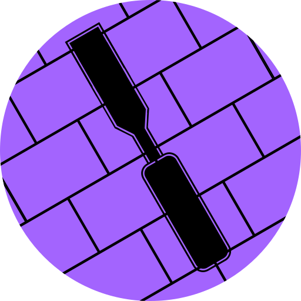

<h1 align="center">Chisel</h1>

A heavy work in progress, cross-platform, godot-based replacement for Valve's Hammer Editor for Source

Created because of the issues regular hammer has that can't be fixed due to it's closed source nature.

Current features:
- 3D camera controls restriced to a 3d view
- Basic UI elements
- Ability to create a cube at the press of a button
 
 
<h1 align="center"> Note for Contributions </h1>
Everything that needs to be recreated from source must be done without any actual Source Engine code. If that's not possible don't bother with the feature.

This project is written in mostly C#. The only GDScript files that remain haven't been converted yet.
